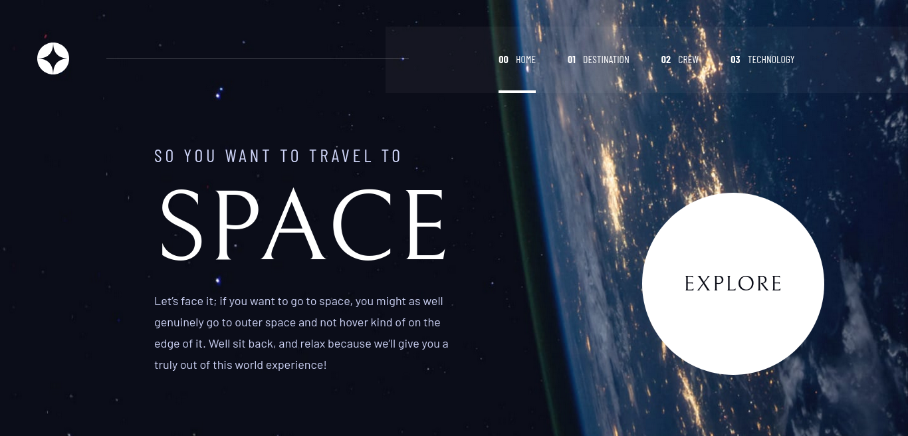

# Frontend Mentor - Solução para o desafio Space Tourism

Essa é a solução para o [desafio Space tourism website do Frontend Mentor](https://www.frontendmentor.io/challenges/space-tourism-multipage-website-gRWj1URZ3). Desafios do Frontend Mentor ajudam a melhorar suas habilidades de programação enquanto você monta projetos realistas.

## Índice

- [Frontend Mentor - Solução para o desafio Space Tourism](#frontend-mentor---solução-para-o-desafio-space-tourism)
  - [Índice](#índice)
  - [Visão Geral](#visão-geral)
    - [O desafio](#o-desafio)
    - [Screenshot](#screenshot)
    - [Links](#links)
  - [Meu processo](#meu-processo)
    - [Feito com](#feito-com)
    - [Experiência](#experiência)
    - [Daqui pra frente](#daqui-pra-frente)
  - [Autor](#autor)
  - [Reconhecimentos](#reconhecimentos)

## Visão Geral

### O desafio

Usuários devem poder:

- Visualizar o melhor layout para cada página do site dependendo do tamanho da tela do seu dispositivo
- Ver estados de _hover_ para todos os elementos interativos na página
- Visualizar cada página e ter a possibilidade de alternar pelas abas para ver novas informações

### Screenshot

### Links

- URL da solução: https://github.com/guilhermemotta/space-tourism-fm-challenge
- URL da demonstração: https://guilhermemotta.github.io/space-tourism-fm-challenge

## Meu processo

### Feito com

- Markup HTML5 semântico
- Flexbox
- CSS Grid
- Workflow mobile-first
- [React](https://reactjs.org/) - Lib JS
- [React Router](https://reactrouter.com/) - Lib de roteamento para SPA
- [TailwindCSS](https://tailwindcss.com/) - Para classes de utilidade e estilo
- [Vite](https://vitejs.dev/) - Para rodar meu ambiente de desenvolvimento, fazer a build do projeto e poder esquecer do Create React App
- Github Pages - Para hospedar a demonstração da solução

### Experiência

Uma boa oportunidade para refrescar minha experiência com layouts responsivos e me manter afiado utilizando React.

Apesar desse projeto não envolver consumo de APIs externas, foi uma boa desculpa para explorar a lib TailwindCSS, que me lembrou a experiência de utilizar Bootstrap, mas sem a parte ruim! (lembranças de abusar da regra !important para sobrecarregar os estilos nativos do Bootstrap).

Mesmo com a "agonia" de ter elementos com classes enormes, confesso que gostei muito de trabalhar com CSS dessa forma, me poupando do overhead de ficar tendo que criar nomes para cada classe (mesmo com a praticidade de utilizar BEM, não sou muito fã da forma clássica de lidar com estilização de HTML).

Esse projeto também me ajudou a "largar o osso" de querer fazer tudo responsivo com Flexbox e me permitiu explorar a utilização do Grid e sua utilização com a regra `grid-template-area` que foi uma mão na roda para a criação das páginas onde os elementos tinham uma ordem específica para aparecer a depender do tamanho da tela.

### Daqui pra frente

No próximo projeto, pretendo dar mais atenção tanto para o trabalho com APIs externas, segurança de rotas e testes.

## Autor

- Github - [Guilherme Motta](https://github.com/guilhermemotta)
- Frontend Mentor - [@guilhermemotta](https://www.frontendmentor.io/profile/guilhermemotta)
- [LinkedIn](https://www.linkedin.com/in/guilherme-motta-125042144)

## Reconhecimentos

- Ter tido a oportunidade de ver como os componentes da lib [DaisyUI](https://daisyui.com/) foram implementados foi de suma importância para a implementação da barra de navegação que usei nesse projeto. A equipe certamente está fazendo um ótimo trabalho com essa biblioteca, tiro o meu chapéu!
- A postagem do Josh Comeau (uma fonte abundante de informações sobre React e Frontend num geral) [Scale with pseudo-elements](https://www.joshwcomeau.com/snippets/html/scale-with-pseudoelements/) me forneceu uma gama de informações que me permitiu implementar o efeito de hover do botão na página raíz no Desktop.
- Depois de tanto bater a cabeça para fazer a implementação da página "Crew" usando Flexbox, consegui alterando para Grid graças às dicas de CSS do [Kevin Powell](https://github.com/kevin-powell) e ao excelente artigo do CSS-Tricks: [A Complete Guide to CSS Grid](https://css-tricks.com/snippets/css/complete-guide-grid).
